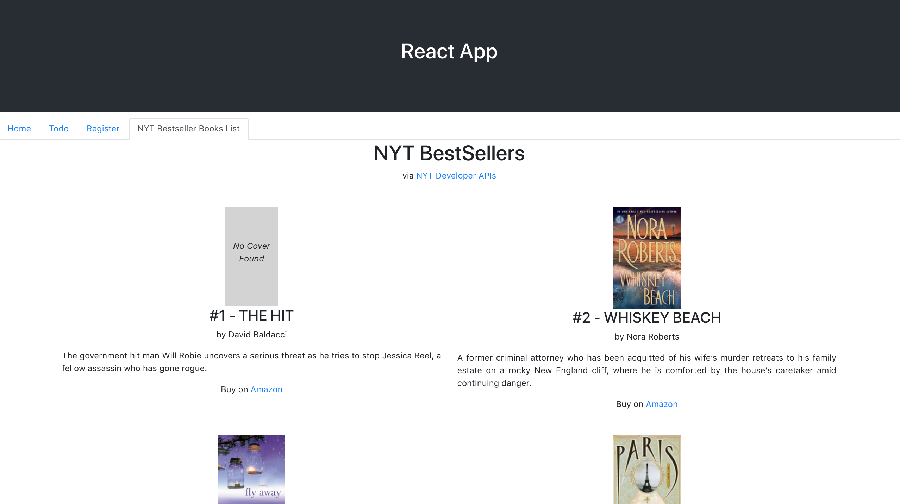

## Running

This project was bootstrapped with [Create React App](https://github.com/facebook/create-react-app).

After cloning:

- `npm install` to restore packages
- Follow steps below to set up developer keys for 3rd Party APIs
- `npm start` to run the app in dev mode (localhost

## API Keys

### NYT Books API

1. Follow the steps outlined on the [NYT Developer Site](https://developer.nytimes.com/get-started) to acquire an API key.
2. Create a file in your app directory called `keys.js` and add your key to the file. 
3. Update BooksList.js to use your api key. 

### Google Books API

1. Follow the steps outlined on the [Google Books Api Site](https://developers.google.com/books/docs/v1/using) to acquire an API key.
2. Complete same subsequent steps as done for the NYT Books API key.